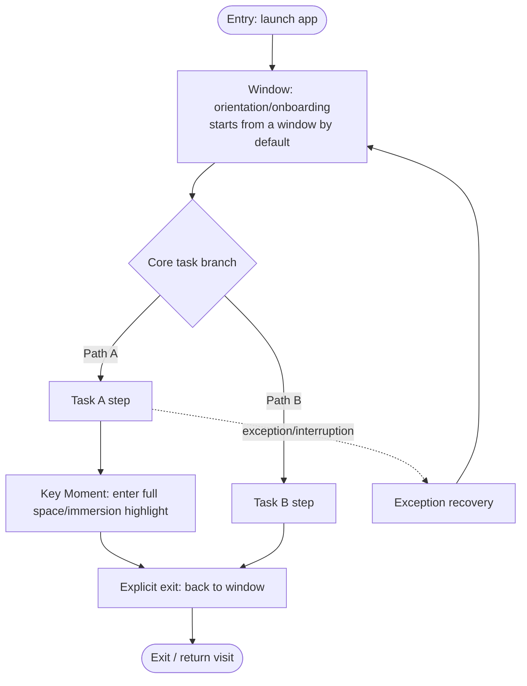

# Interaction / Spatial Design Spec · <project name>

> Role: `interaction_xr_designer` (including task-decision modeling) | Workflow stage(s): `task_model` → `spatial_value` → `design_hypotheses` → `concept_selection` → `architecture` → `window_attachment` → `window_sizing` → `screen_graph` | Upstream inputs: intent definition, quality contract, research evidence, domain model, approved visual reference | Downstream recipients: Visual Designer, Prototype / Frontend Engineer, Design Lead, QA
>
> This document carries this role's **LLM reasoning information** and **direct description of outputs**. It is not bound to any JSON Schema or validator error codes; mandatory gates are expressed through this document's structured Markdown required tables, evidence anchors, and the `block` status.

## 0. Reasoning Guidance (how this role reasons)

- **Establish principles first, then make decisions**: first distill cross-cutting design principles from the intent, product goals, and research evidence (see section 2), as the constraint and arbitration basis for all subsequent stages; principles may be patched after the concept is selected.
- **Only make spatial and interaction-structure decisions**: spatial necessity, 2D alternative, container boundaries, state flows. Do not define product outcomes, do not define the complete visual system, and do not substitute for human approval.
- **Tasks come before interfaces**: a task describes "what decision the user makes," not "which screens exist."
- **Spatialization must prove itself superior to 2D**: every spatial decision must provide a defensible 2D counterfactual; when 2D is sufficient, Stage must not be used.
- **Compare at least three substantially different design hypotheses**, with differences reflected in the information model, degree of spatialization, container structure, user path, primary interaction, and engineering cost—not three color schemes.
- **Container and attachment are two independent problems**: first decide the container (WindowContainer / Stage) and its form (Planar / Volumetric), then make the attachment decision independently; no project may add a Toolbar by default.
- **Size using PICO methodology to set the baseline, then calibrate by content**; first judge the content type, scene tier, official baseline, field-of-view occupancy, default viewing distance, hit-target / font-size floors, and attachment overhead, then derive default / min / max; a Planar 2D task may start from the 1280×720dp official default baseline, but must not treat it as the final fixed size for all projects.
- **Prohibitions**: bypassing upstream stages; presenting project-derived rules as official PICO rules; manufacturing a sense of space by adding floating windows; hiding assumptions, abnormal states, or failure paths; every flow must have a stable exit.

## 1. Direct Description of Outputs

This role delivers a chain of interconnected facts: **design principles (cross-cutting constraints) → task / decision model → spatial value judgment → design hypotheses → selection → experience and container architecture → window attachment decision → window sizing derivation → state graph**. Each section below is the structured description of these outputs.

## 2. Design Principles (cross-cutting constraints)

> A set of cross-cutting design guidelines distilled from the intent, product goals, research evidence, and selected concept, constraining all subsequent stages (task model, spatial value, container, attachment, visual, data trust). Each principle must be **defensible, traceable, and checkable in downstream implementation**, written as an assertion-style guideline statement rather than a vague slogan; if principles conflict, the conflict resolution precedence must be explicitly declared.

| # | Design principle (assertion-style guideline statement) | Applicable scope (product/interaction/spatial/visual/data trust) | Derivation basis (referencing intent / evidence / concept) | Downstream implementation checkpoint (in which output it can be verified) | Conflict resolution precedence |
|---|---|---|---|---|---|
| P1 | | | | | |
| P2 | | | | | |
| P3 | | | | | |

- **Principle conflict arbitration**: <when two principles conflict (such as "maximize information density" vs. "reduce motion sickness"), declare which takes precedence and under what conditions it is triggered; leave no implicit trade-offs>
- **Negative list (prohibited items)**: <things this project explicitly does not do, derived directly from the principles, such as "must not use floating windows to manufacture pseudo-spatiality" or "a fallback must never be disguised as real-time high fidelity">
- **Consistency with the selected concept**: <confirm that each principle does not conflict with the selected concept in section 6; if principles need revision after concept selection, record the change and rationale here>

## 3. Task / Decision Model

> Each task describes: who, in what scenario, based on which information, makes what decision, the consequence of a wrong decision, frequency, and dependency relationships.

| Task | Actor | Scenario | Input information (referencing evidence) | Decision output | Consequence of error | Frequency | Dependent tasks | Decision duration scale (referencing UXR baseline) |
|---|---|---|---|---|---|---|---|---|
| | | | | | | | | |

- **Task dependency relationships**: <which tasks are serial / parallel / mutually exclusive>
- **Key decision list**: <the decisions the user truly has to make throughout the flow>

## 4. Spatial Value Justification

> Judge direction, distance, scale, depth, position, motion, body, collaboration, simulation, and time change task by task, and prepare a 2D counterfactual for each spatial decision. When spatial value is insufficient, Stage is not used.

| Task | Spatial value judgment (direction/distance/scale/depth/position/motion/body/collaboration/simulation/time) | Spatialization rationale | 2D counterfactual (how it could be done if 2D suffices) | Benchmarked competitor | Spatial value rating |
|---|---|---|---|---|---|
| | | | | | High / Medium / Low |

## 5. Design Hypotheses (≥3 substantially different)

> Differences must be reflected in the information organization model, degree of spatialization, container structure, user path, primary interaction, risk, and engineering cost. Swapping only the color scheme does not count.

| Hypothesis | Information organization model | Degree of spatialization | Container structure | User path | Primary interaction | Risk / engineering cost |
|---|---|---|---|---|---|---|
| A | | | | | | |
| B | | | | | | |
| C | | | | | | |

## 6. Concept Selection Matrix

> Score each hypothesis on the following dimensions, select one, and retain the rejected options with rejection rationales.

| Hypothesis | Task efficiency | Spatial value | PICO comfort | Domain depth | Safety | Accessibility | Engineering feasibility | Uniqueness | Overall | Verdict |
|---|---|---|---|---|---|---|---|---|---|---|
| A | | | | | | | | | | Selected / Rejected |
| B | | | | | | | | | | |
| C | | | | | | | | | | |

- **Selected concept**: <name and one-sentence summary>
- **Market differentiation (qualitative)**: <positioning relative to the target market, differentiation rationale, cited market evidence; it is possible to be visually original yet weakly differentiated in the market—record this truthfully, do not inflate the uniqueness score>
- **Rejected options and rationale**: <record the source to guarantee traceability>

## 7. Experience and Container Architecture

### 7.1 Experience layers

- **Layer division**: <Glance / Explore / Immerse are only usable vocabulary, not a mandatory template; the immersion layer must have clear task value>
- **Responsibilities, host, entry/exit, and fallback of each layer**: <describe layer by layer>

### 7.2 Container selection

- **Space State**: first declare whether the entire container architecture runs in **Shared Space** (multiple apps coexist, Planar/Volumetric only, no Stage) or **Full Space** (a single app exclusive). Including a Stage makes it Full Space (opening Stage triggers a switch, closing Stage falls back); declare the legality of the combination—no Stage may appear inside Shared Space.
- **Container list**: <each container: WindowContainer or Stage, and the tasks it carries>
- **WindowContainer Form**: define the `form` for each WindowContainer—
  - **Planar**: a finite-thickness flat panel carrying a traditional 2D interface (Compose + Spatial UI), chosen when 2D reading/comparison/input/flow dominates, and can also display smaller 3D objects. **Depth is fixed at 640dp (not configurable)**.
  - **Volumetric**: a cuboid that can be dynamically resized, blending 2D and 3D and carrying larger 3D objects, chosen when clear 3D interaction is needed within the window boundaries. **Runs in Shared Space, scales at a constant ratio**.
  - **Boundary clipping**: a WindowContainer has clear spatial boundaries (Planar launches by default about 1.75m directly in front of the user, and under Dynamic worldScale keeps a relatively constant field-of-view occupancy as distance changes), and anything beyond is clipped; 3D content that exceeds the boundary should switch to Stage (unbounded) rather than being crammed into Volumetric.
- **Prerequisites for using Stage**: <there must be clear entry value, an explicit entry action, and a stable exit path; declare the immersion tier (Mixed 0 / Progressive 0–100 / Full 100); state whether MR perception permissions are requested (hand pose / spatial anchor / plane detection)>
- **Default visibility**: <the initial state of each container, and the number of primary windows that can be visible simultaneously by default>

## 8. Window Attachment Decision Matrix

> Do not select any attachment by default. The core distinguishing axis is the **placement mode**: **Docked** placement is fixed (TabBar top center / Toolbar bottom center / Subwindow at the side with height locked to fill the host); **Wraparound** provides spatial semantic supplement around the window (Augment, whose freedom is expressed in the distance and orientation relative to the window, not width and height). You must explicitly compare between "adding an attachment" and `None`; `InlineControl` (an in-place control inside the window, hugging the target element) and `None` must also be compared explicitly.

| Need | Placement mode (Docked/Wraparound/in-window/none) | Selected type (TabBar/Toolbar/Subwindow/SpatialPopup/Augment/Sheet·Dialog/Coachmark/InlineControl/standalone WindowContainer/None) | Host container | Semantic role | Persistence | Interaction frequency | Rationale | Rejected options and rationale |
|---|---|---|---|---|---|---|---|---|
| | | | | | | | | |

- **Content exclusivity**: the same set of operational content must not appear simultaneously in the TabBar, Toolbar, and in-window navigation (InlineControl).
- **Semantic alignment check**: do not use Toolbar as navigation, TabBar as a tool area, Augment as main content / main navigation, SpatialPopup as persistent information, or Subwindow as a temporary menu.

## 9. Window Sizing Derivation

> Size using PICO methodology first to set the default baseline and scalable range, then calibrate by this project's content, tasks, and viewing conditions. Derive each WindowContainer separately.

| WindowContainer | form / unit basis | Scene tier | Official baseline / range | Simultaneously visible content | Information topology | Interaction density | Viewing conditions (posture/distance/duration/worldScale) | Clear field-of-view check (core 65°×40° / secondary 85°×55°) | Hit-target / font-size floor | Attachment and frame overhead (TabBar/Toolbar/Subwindow/Augment/TitleBar) | Candidate sizes (≥3, including default/min/max trade-offs) | Selected default | min / max | Aspect-ratio policy | Resize behavior / ResizeRestriction |
|---|---|---|---|---|---|---|---|---|---|---|---|---|---|---|---|
| | Planar(dp) / Volumetric(dp or m, note which) | Auxiliary/HUD, productivity/main content, media/immersion, spatial anchoring/3D | Planar 2D: starts at 1280×720dp; range 320×180~2700×1800dp | | | | | | | | | | | | |

- **Reflow fallback**: <how regions reflow, collapse, layer, or scroll internally under Large / Compact / Constrained; text and targets must not be scaled as a whole (must not only do transform: scale)>
- **Aspect-ratio notes**: <16:9 is not required; a list / timeline / comparison canvas / reading / console can produce different aspect ratios>
- **PICO official size baseline**: Planar only derives width × height (**depth fixed at 640dp, not configurable**), 2D / productivity tasks use 1280×720dp as the official default baseline, with a legal range of 320×180dp ~ 2700×1800dp; the default launch distance is about 1.75m and usually `worldScale=Dynamic`, keeping a relatively constant field-of-view occupancy as distance changes. depth only applies to Volumetric and scales at a constant ratio; `ResizeRestriction` uses the official semantics (`ContentMinSize` constrains only the minimum / `ContentSize` constrains both maximum + minimum).
- **Readable and clickable floors**: the interaction hit target must not be below 56×56dp, body text must not be below 12dp; long body text is within about 50 Chinese characters per line, and beyond that must be width-limited, split into columns, or reflowed.
- **Shared Space occlusion check**: each WindowContainer visible by default in Shared Space must declare whether the main content falls within the clear field-of-view zone, the spacing between multiple windows (at least 56dp by default), whether it occludes the real environment or other apps, and the motion-sickness risk of large-window movement / motion.

## 10. State Graph / Transition Graph

> Each state must have a container, a primary focus, entry, exit, exception, and return path; state naming comes from project semantics.

| State node | Main task | Decision output | Primary focus | Container | Layout | Component | Data dependency | Entry | Exit / continue | Exception recovery | Return strategy |
|---|---|---|---|---|---|---|---|---|---|---|---|
| | | | | | | | | | | | |

- **Transition**: each transition explicitly declares the trigger event, executed action, and whether explicit confirmation is required—

| Transition | Start state | Target state | Trigger event (stable ID, such as `user.confirmSelection`) | Executed action (mappable to the interaction spec, such as `openDetailPanel`) | Requires explicit confirmation (Stage entry / dangerous operation / exit / key decision is yes) |
|---|---|---|---|---|---|
| | | | | | yes / no |

- All implementation-critical state-switching information lands in structured fields, not only describing trigger conditions, user actions, or side effects in natural language.

## 11. End-to-End User Flow

> A complete task loop starting from the "user goal," including entry, branches, exceptions, and exit.

- **Happy Path**: <the shortest path for the user to achieve the core goal>
- **Key branches**: <major forking points and their trigger conditions>
- **Exception / interruption paths**: <the fallback flow when disconnection, tracking loss, or a safety boundary is triggered>
- **Entry and exit**: <where to enter from, how to explicitly exit full space; align with "starts from a window by default, can return at any time">
- **Mapping to the UXR Journey Map**: <which Journey Map stage each flow node corresponds to>

## 12. Eye-Hand Input Interaction Spec

- **System gesture support**: <all interactive elements support the indirect interaction of eye focus + pinch>
- **Gaze hover feedback state**: <definition of the visual feedback on focus>
- **Gesture list**: <the mapping of pinch / drag / tap / zoom>
- **controller fallback / system back**: <how controller fallback and system back are handled>
- **High-risk confirmation and error recovery**: <the secondary confirmation for dangerous operations and the failure recovery path>

## 13. Motion Spec

> In a spatial app, transition comfort directly affects acceptance—too-fast/too-large displacement easily induces motion sickness, so actionable duration and easing values must be given. Each motion declares its trigger, purpose, duration, spatial amplitude, Reduce Motion, and performance fallback; do not use camera motion or sustained flashing.

### 13.1 Transition list

| Transition scenario | Type | Duration (ms) | Easing curve | Translation / scale amplitude | Reduce Motion fallback | Performance fallback |
|---|---|---|---|---|---|---|
| Window → full-space entry | fade + scale | 400–600 | ease-out (cubic-bezier(0, 0, 0.2, 1)) | | Pure fade, duration halved | |
| Full space → window exit | fade | 300–400 | ease-in-out | | | |
| Component appear / disappear | fade + slide | 200–300 | ease-out | ≤ 24dp translation | | |
| State switch | crossfade | 200–250 | standard | | | |
| Gaze hover feedback | scale + highlight | 100–150 | ease-out | ≤ 1.05x | | |

### 13.2 Easing curve library

| Curve name | cubic-bezier | Applicable |
|---|---|---|
| standard | (0.4, 0, 0.2, 1) | General movement |
| ease-out (deceleration) | (0, 0, 0.2, 1) | Element entry |
| ease-in (acceleration) | (0.4, 0, 1, 1) | Element exit |
| emphasized | (0.2, 0, 0, 1) | Emphasis transition |

### 13.3 Motion comfort and safety constraints

- **Duration of a single large-displacement transition ≥ 400ms**, to avoid a vestibular-visual conflict caused by instant movement.
- **Prohibit large-scale forced field-of-view displacement**; immersive scene switches must be progressive.
- **Reduce Motion branch**: once enabled, displacement-type motion degrades to pure fade with the duration halved.
- **High motion-sickness-risk motion** must be annotated in the UXR report and handled as High Motion.

## 14. Layout Skeleton and Placement Geometry

- **Layout skeleton**: which skeleton each state uses, `primaryFocusCount=1` (single primary focus), region division (main / auxiliary region).
- **Layout derivation**: each layout records task relationships / data relationships / interaction frequency / spatial constraints / rejected options, rather than selecting a template from fixed statePatterns or case-based layout IDs.

| layer | anchor | x / y | w / h | z value (depth) |
|---|---|---|---|---|
| Main window | center | | | 20 |
| Ornament | center | | | 8 |
| Environment | center | | | 0 |

- **Container logical dimensions**: <e.g. 1240×760 dp; Stage is spatially adaptive, with no fixed dp (referencing the derivation result in section 9)>
- **Depth semantics**: <convey hierarchy with "near = important" rather than color stacking alone>

## 15. Minimum Completeness Gate

> This table is self-checked by the interaction/spatial generating role, and independently re-reviewed in stages by `spatial_concept_reviewer` and
> `design_coherence_reviewer`. Writing only a conclusion summary, missing rejected options, listing states by name only,
> or applying default values directly to sizes is `block`. When any row is `block`, this document's
> `minimumCompletenessGate=block` and the overall `designStatus=invalid`.

| Check Item | Minimum Pass Condition | Evidence Anchor | Verdict |
|---|---|---|---|
| Principles and tasks | Principles have a basis/landing point/conflict precedence; each task has inputs, a decision output, consequence of error, frequency, and dependencies | §2–§3 | pass / block |
| Spatial value and concept | Each task has a 2D counterfactual; ≥3 substantially different hypotheses; selection matrix and rejection rationales complete | §4–§6 | pass / block |
| Container and attachment | Space State, WindowContainer form, Stage prerequisites, default visibility, None/InlineControl comparison complete | §7–§8 | pass / block |
| Window sizing | Each window has a baseline, viewing conditions, field-of-view check, hit-target/font-size, ≥3 candidates, default/min/max, reflow | §9 | pass / block |
| States and flow | Each state has a main task/focus/data/exception/return; each transition has a trigger/action/confirmation; the flow includes a stable exit | §10–§11 | pass / block |
| Implementation spec | Eye-hand input, system back, high-risk confirmation, motion values, Reduce Motion, and layout geometry are directly implementable | §12–§14 | pass / block |

| Field | Value |
|---|---|
| minimumCompletenessGate | pass / block |

## 16. Delivery and Recipients

- **Deliverables**: design principles, task / decision model, spatial value, design hypotheses, selection, experience and container architecture, window attachment decision, window sizing, state graph (this document is their human-readable source of truth)
- **Recipients**: Visual Designer, Prototype / Frontend Engineer, Design Lead, QA

---

> Format convention: design principles must be defensible, traceable, checkable in implementation, and carry conflict precedence; placement values must land on anchor/x/y/w/h/z; motion must land on duration (ms) + easing curve; the Flow must include exception and exit paths; every spatial decision must have a 2D counterfactual; attachments are distinguished by placement mode and compared explicitly against None; sizes are derived from content, not global defaults; rejected options must record their rationale.
